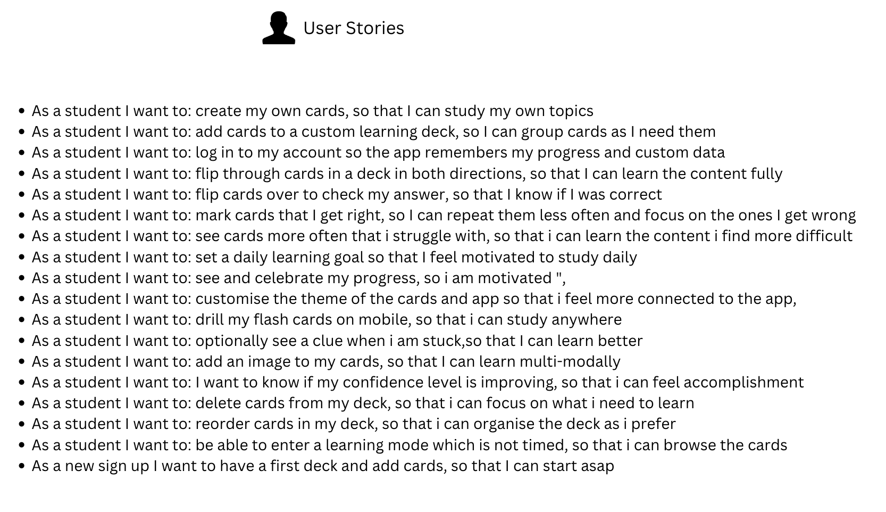
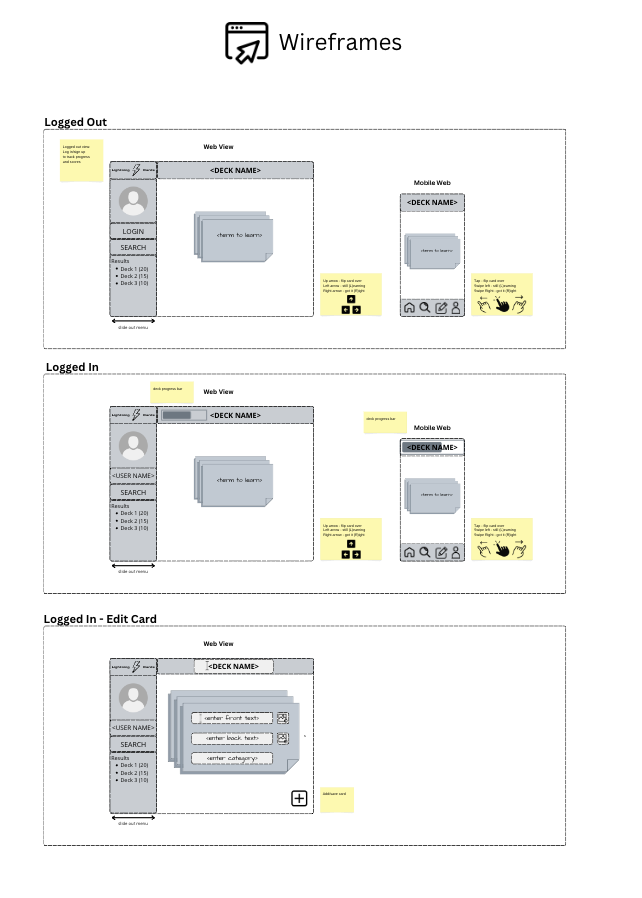
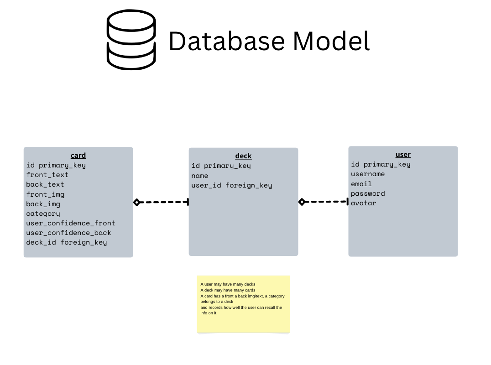

# LIGHTNING FLASH CARDS
>learn *anything* in a *flash*

Create a set of flash cards
on any topic
and drill them to commit content to
long term memory

[Live site](https://lightning-flash-cards.herokuapp.com/)

### TEST USERS
login: `max@fake.com`, password: `chicken`
login: `jane@fake.com`, password: `chicken`
login: `fiona@fake.com`, password: `chicken`

### BACKGROUND
This is the second project I made as part of the Software Engineer Immersive course at General Assembly Sydney.
I spent two weeks learning Ruby on Rails and this project was to demonstrate the knowledge I have retained.

### FEATURES
- Randomised order of cards in Play mode
- Signup/login/logout
- Custom deck of flash cards
- Flip card animation
- User confidence tracking, see less confident cards more often
- Space bar/click to flip a card
- Right/left arrow keys to indicate right/wrong answers

### TECH STACK
- Ruby on Rails
- ActiveRecord
- Postgresql
- Javascript
- jQuery
- Deployed on Heroku

### INSTALL LOCALLY
1. $`rails db:migrate`
1. $`rails db:seed`
1. $`rails s`
1. open localhost:3000 in browser

---
### USER STORIES

### WIREFRAMES

### DATA STRUCTURE

### Known Issues
- arrow key handler fires on all screens (not just play mode) causing js errors
- performance issue in card randomiser when user increases in confidence  

### Roadmap / Wishlist
- upload images to cards
- upload user avatar
- card animations for swipe left and and right
- set study goal and timer
- user stats and celebration 
- track and report improvement in card confidence 
- mobile friendly view - swipe controls